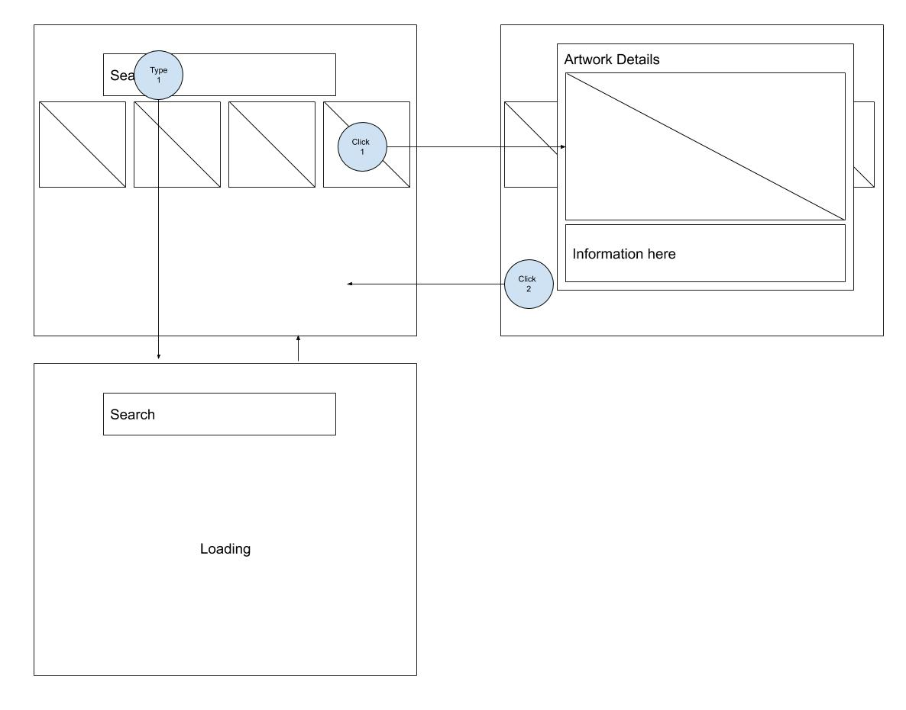
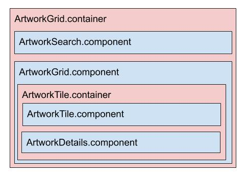

# Image Gallery
## User Story
As a user I want to view a set of images so that I can find the one I want.

## Acceptance Criteria
* I must be able to view a list of images
* I must be able to select an image to see further details
* I must be able to search the images by name

## Solution
I have opted to build a React application that is using the Metropolitan Museum of Arts Open Collection project as a back end.

This has the advantage of allowing me to focus on the front end code base and spend more time in design and producing a quality codebase within the time constraints. 

With more time and some extra requirements (e.g. tracking views, richer search, analytics) I would have fleshed out the infrastructure with a GraphQL API with Elasticsearch, authenitication and analytics all provisioned with AWS Amplify. 

In real world, instead of relying on the open project at the Met (not a good choice for a production system) I would have built an import to load the public domain artworks into S3 and indexed the text attributes of the artwork data (title, artist, description etc) in Elasticsearch and used the search results from the GraphQL API to return pointers to S3 (rather than image URLs from the Met). 

This was my initial plan when I read the b

## App Wireframe

* Click 1: When a user clicks on an artwork tile the artwork details modal is launched.
* Click 2: When a user clicks out of the modal it is closed
* Type 1: When a user enters text into the search the default* list is automatically updated

\* default list: the search field will be populated by default with an example search term.

## Component Heirarchy

### Artwork Grid Container
* Responsible for retrieving a search term from ArtworkSearch, querying the API an array of artwork IDs into
the ArtworkGrid.

### Artwork Tile Container
* Recieves an ID as a prop from ArtworkGrid and querys the API for the artwork data which is then used to populate
the ArtworkTile and ArtworkDetails components.
* Listens for user clicks and decides whether to render details modal